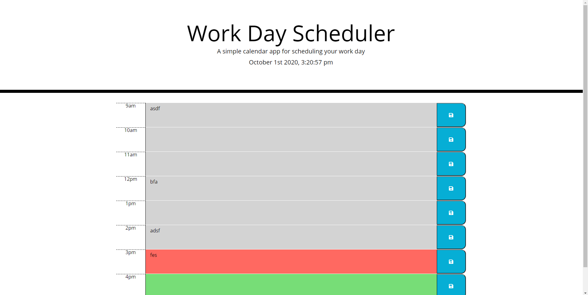

# HW5-DayScheduler

Created a day planner application that allows users to enter their tasks and schedule from 9am to 5pm. The app runs on the users browser and features color changes depending on the current time.

On the right side of the planner, the user is able to save on their input - meaning they can save their request to local storage.

## Purpose and Requirement

As an employee with a busy schedule, a user can add important events to the planner so that they can manage their time effectively. This schedule is to be used between working hours (9AM to 5PM).

1. Open the web page to start using the scheduler.
2. Check and display the current time.
3. The calendar will display green if the hour block is in the future, grey if past, and red will allways be on the current hour.
4. User can click and enter text into a timeblock.
4. Click on the save button to the input.
5. If you refresh the page, your content will remain on the page.

### Screen shot of deployed application

#### Links to deployed application and repo.

https://mcduderson.github.io/HW5-DayScheduler/.

https://github.com/Mcduderson/HW5-DayScheduler